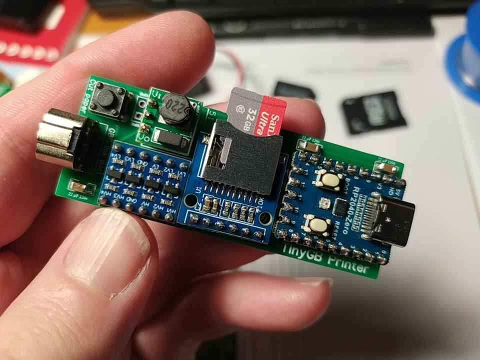

# The TinyGB Printer - A portable Game Boy Printer emulator

The TinyGB Printer is the tiniest possible Game Boy printer emulator storing images on SD card made with common parts and easy to assemble. It is basically a demake of the quite convoluted [NeoGB printer](https://github.com/zenaro147/NeoGB-Printer) or a reboot of the way too expensive [BitBoy](https://gameboyphoto.bigcartel.com/product/bitboy). The device has 100% compatibility with all known GB/GBC games, homebrews included. It stores the printed images in pixel perfect 4x PNG format by default. It is of course fully open source.

## Showcase

## Yet another printer emulator ?! What's different ?
This printer emulator does not require any additional converter, it contains its own. The goal is to provide an easy way to get images out of your precious saves without the hassle of installing / configuring / running a decoder on a diversity of OS. Here everything is simple: build the device, drop the compiled binary to it, print and publish immediately your images direct from the SD card. Only skill required is very basic knowldege in soldering.

This is basically the Game Boy printer of my dreams: a BitBoy without the crashes, with a decent output format and two printing modes.

## What's inside / how does it work ?
The code is basically the [Arduino Game Boy Printer emulator](https://github.com/mofosyne/arduino-gameboy-printer-emulator) (with a bit of butchering to adapt it) running on core 0 and a custom image decoder running on core 1 in parallel. Core 0 politely asks core 1 to convert data at certain times with a flag. Core 0 is ultra busy with interrupts while core 1 is pretty idle and has a ton of free time to create images. The device uses a 1xBMP image as temporary storage container to avoid memory overflow (images have no limitation in height, only in width) and converts it to 4x PNG at the end, like the NeoGB Printer.

Why not starting from another emulator yet made for a Pi Pico ? Because I have tested / debugged / pimped this particular one during months / years with more than 100 games and I'm sure it is 100% compatible even with homebrews. On the other hand, it was easier to restart from fresh than to adapt the NeoGB Printer code very polished for the ESP32.

## Easy to install
- After soldering everything, connect the Raspberry Pi Pico with a USB cable to your computer while pressing BOOT, drop the [uf2 file](/Builds) to the USB folder poping out and enjoy your device. If it makes smoke, check for shorts with a multimeter.
- If you want to modify the code and compile it, use the [Arduino IDE](https://www.arduino.cc/en/software) equipped with the [RP2040 core for Arduino IDE](https://github.com/earlephilhower/arduino-pico). Then from the Arduino library manager install the [PNGEnc library](https://github.com/bitbank2/PNGenc) and the [Adafruit Neopixel for Arduino IDE](https://github.com/adafruit/Adafruit_NeoPixel), choose the Waveshare RP2040 PiZero and compile/upload with the default options.

## Easy to use
- Switch the device on without touching anything, the LED flashes green, images are recorded automatically. This is perfect for the Game Boy Camera for example. Multi-prints is of course supported.
- Switch the device on while pressing the pushbutton : the LED flashes blue, all images are stacked together in a single file until you press the pushbutton to "tear paper". Some rare games require this (see compatibility list).
- Switch the device on and the LED blinks red on and off in cycle: SD card not connected or not formatted in FAT32. SD card can be inserted during this step, the device will then boot normally.

A new folder is created at each boot. Each image file has a unique ID. Flashes during printing indicate packet transmission. Color of flashes indicates the mode (green for automatic, blue for tear mode). Red / magenta / yellow flashes during a print session indicate decoder / access to SD card / PNG encoding. **Do not switch off while the led is on, images are being processed.**

## Easy to fabricate
**Parts to order:**
- [The PCB](/PCB). Order at [JLCPCB.com](https://jlcpcb.com/) (just drop the gerber .zip to the site and use default options). VAT is paid when ordering so no bad surprise for European customers. The PCB was designed with [EasyEDA Standard Edition](https://easyeda.com/) if you want to modify something.
- [A Raspberry Pi Pico Zero](https://fr.aliexpress.com/item/1005005862794169.html). Just check pinout if seller is not the same.
- [A bare MicroSD shield](https://fr.aliexpress.com/item/1005005302035188.html) without internal power converter and pin header. The most simple.
- [A 4 gates level shifter](https://fr.aliexpress.com/item/1005004560297038.html). The Pi Pico pins are not 5V rated, so the need for a level shifter.
- [A 5V DC-DC step-up converter](https://fr.aliexpress.com/item/32809095271.html), 0.9-5V (input) to 5V (output).
- [Pin headers](https://fr.aliexpress.com/item/1005007324368709.html) with 2.54 mm spacing.
- [A GBA/GBC Game Boy serial slot](https://fr.aliexpress.com/item/1005006361884480.html). They can be cheap or not depending on the seller, do not hesitate to change.
- [A 6x6 mm pushbutton](https://fr.aliexpress.com/item/1005003938244847.html), whatever height. The softer the better.
- [3x22 µF caps with a 1206](https://fr.aliexpress.com/item/1005006022131059.html) (10 to 50 µF is OK if you have spares).
- [An AMS1117-3.3V converter](https://fr.aliexpress.com/item/4001104149446.html). The SD card is powered independently by this converter as the Pi Pico puny onboard converter is not powerfull enough.
- A [2xAA](https://fr.aliexpress.com/item/4000980371784.html) or [2xAAA](https://fr.aliexpress.com/item/1005004195965365.html) battery box with switch. Single AA battery is a bit too weak to power the device reliably (it can work or not).

**How to make it:**
- Solder the pin headers on the Pi Pico, the SD shield, the level shifter and the step-up converter. Beware of which side you solder the pin header. Check if you can drop the uf2 file to the Pico, it must blink red on and off, it's normal.
- Solder the caps and the 3.3V converter first. They are surface mount components but big enough to be soldered easily. Don't be afraid by their size. They are not tiny, trust me.
- Solder all parts with minimal the clearance possible against the PCB.
- Trim and reflow all pins on the back side to get a clean finish. I personally trim pins as short as possible before soldering but there is a risk of scratching the solder mask, so be carefull.
- Solder the battery box terminals and stuck the PCB on it with double sided tape for example (or hot glue).
- You're ready to print !

**Troubleshooting**
- Last image is not written, unreadable or in BMP format ? You've probably switched the device off while the led was still on or you forgot to tear paper with the pushbutton in tear mode.
- Last batch of images is incomplete (empty folder or just first images recorded with a multi-print) ? The batteries are out of juice, recharge them.

## 100% compatibie with all known games using the Game Boy Printer
In *Italics* game working fine in automatic mode, in **bold** games requiring the pushbutton to tear paper, or tear mode. 
All known homebrews to date are compatible with the automatic mode (like Photo!).

- *1942 (never released in Japan)*
- *Alice in Wonderland (never released in Japan)*
- *Animal Breeder 3 (あにまるぶりーだー3)*
- *Animal Breeder 4 (あにまるぶり〜だ〜4)*
- *Aqualife (アクアライフ)*
- *Asteroids (never released in Japan)*
- *Austin Powers: Oh, Behave! (never released in Japan)*
- *Austin Powers: Welcome to My Underground Lair! (never released in Japan)*
- *Austin Power Episode 3 - Yeah Baby Yeah (unreleased, rom CGBBA3P0.3)*
- *Austin Power Episode 4 - Why Make Millions (unreleased, rom CGBBA4P0.0)*
- *Cardcaptor Sakura: Itsumo Sakura-chan to Issho! (カードキャプターさくら 〜いつもさくらちゃんと一緒〜)*
- *Cardcaptor Sakura: Tomoe Shōgakkō Daiundōkai (カードキャプターさくら 〜友枝小学校大運動会〜)*
- *Chee-Chai Alien (ちっちゃいエイリアン)*
- *Cross Hunter - Monster Hunter Version (クロスハンター モンスター・ハンター・バージョン)*
- *Cross Hunter - Treasure Hunter (クロスハンター トレジャー・ハンター・バージョン)*
- *Cross Hunter - X Hunter Version (クロスハンター エックス・ハンター・バージョン)*
- *Daa! Daa! Daa! Totsuzen ★ Card de Battle de Uranai de!? (だぁ!だぁ!だぁ! とつぜん★カードでバトルで占いで!?)*
- *Daikaijuu Monogatari: The Miracle of the Zone II (大貝獣物語 ザ・ミラクル オブ ザ・ゾーンII)*
- *Dejiko no Mahjong Party (でじこの麻雀パーティー)*
- *Densha de GO! 2 (電車でGO!2)*
- *Dino Breeder 3 - Gaia Fukkatsu (ディノブリーダー3 〜ガイア復活〜)*
- *Disney's Dinosaur (never released in Japan)*
- *Disney's Tarzan (ディズニーズ ターザン)*
- *Donkey Kong Country (ドンキーコング2001)*
- *Doraemon Kart 2 (ドラえもんカート2)*
- *Doraemon Memories - Nobita no Omoide Daibouken (ドラえもんメモリーズ のび太の想い出大冒険)*
- *Doraemon no Game Boy de Asobouyo Deluxe 10 (ドラえもんのGBであそぼうよ デラックス10)*
- *Doraemon no Quiz Boy (ドラえもんのクイズボーイ)*
- *Dungeon Savior (ダンジョンセイバー)*
- **E.T.: Digital Companion (never released in Japan)**
- *Fairy Kitty no Kaiun Jiten: Yousei no Kuni no Uranai Shugyou (フェアリーキティの開運辞典 妖精の国の占い修行)*
- *Fisher-Price Rescue Heroes: Fire Frenzy (never released in Japan)*
- *Game Boy Camera or Pocket Camera (ポケットカメラ)*
- *Golf Ou: The King of Golf (ゴルフ王)*
- *Hamster Club (ハムスター倶楽部)*
- *Hamster Paradise (ハムスターパラダイス)*
- *Hamster Paradise 2 (ハムスターパラダイス2)*
- *Harvest Moon 2 (牧場物語GB2)*
- *Hello Kitty no Beads Koubou (ハローキティのビーズ工房)*
- **Hello Kitty no Magical Museum (ハローキティのマジカルミュージアム)**
- *Hello Kitty Pocket Camera (ハローキティのポケットカメラ, unreleased, rom GBDHKAJ0.2)*
- *Jinsei Game Tomodachi takusan Tsukurou Yo! (人生ゲーム 友達たくさんつくろうよ!)*
- *Kakurenbo Battle Monster Tactics (モンスタータクティクス)*
- *Kanji Boy (漢字BOY)*
- *Karamuchou wa Oosawagi!: Porinkiis to Okashina Nakamatachi (カラムー町は大さわぎ! 〜ポリンキーズとおかしな仲間たち〜)*
- *Karamuchou wa Oosawagi!: Okawari! (カラムー町は大さわぎ！おかわりっ！)*
- *Kaseki Sousei Reborn II: Monster Digger (化石創世リボーン2 〜モンスターティガー〜)*
- *Kettou Transformers Beast Wars - Beast Senshi Saikyou Ketteisen (決闘トランスフォーマービーストウォーズ ビースト戦士最強決定戦)*
- *Kidou Senkan Nadesico - Ruri Ruri Mahjong (機動戦艦ナデシコ ルリルリ麻雀)*
- *Kisekae Monogatari (きせかえ物語)*
- *Klax (never released in Japan)*
- *Konchuu Hakase 2 (昆虫博士2)*
- *Little Nicky (never released in Japan)*
- *Logical (never released in Japan)*
- *Love Hina Pocket (ラブ ひな)*
- *Magical Drop (never released in Japan)*
- **Mary-Kate and Ashley Pocket Planner (never released in Japan)**
- **McDonald's Monogatari : Honobono Tenchou Ikusei Game (マクドナルド物語)**
- *Mickey's Racing Adventure (never released in Japan)*
- *Mickey's Speedway USA (never released in Japan)*
- *Mission: Impossible (never released in Japan)*
- *Monster ★ Race 2 (もんすたあ★レース2)*
- *Monster ★ Race Okawari (もんすたあ★レース おかわり)*
- *Nakayoshi Cooking Series 1 - Oishii Cake-ya-san (なかよしクッキングシリーズ1 おいしいケーキ屋さん)*
- *Nakayoshi Cooking Series 2 - Oishii Panya-san (なかよしクッキングシリーズ2 おいしいパン屋さん)*
- **Nakayoshi Cooking Series 3 - Tanoshii Obentou (なかよしクッキングシリーズ3 たのしいお弁当)**
- **Nakayoshi Cooking Series 4 - Tanoshii Dessert (なかよしクッキングシリーズ4 たのしいデザート)**
- **Nakayoshi Cooking Series 5 - Cake Wo Tsukurou (なかよしクッキングシリーズ5 こむぎちゃんのケーキをつくろう!)**
- *Nakayoshi Pet Series 1: Kawaii Hamster (なかよしペットシリーズ1 かわいいハムスタ)*
- *Nakayoshi Pet Series 2: Kawaii Usagi (なかよしペットシリーズ2 かわいいウサギ)*
- *Nakayoshi Pet Series 3: Kawaii koinu (なかよしペットシリーズ3 かわいい仔犬)*
- *NFL Blitz (never released in Japan)*
- **Nintama Rantarou GB: Eawase Challenge Puzzle (忍たま乱太郎GB えあわせチャレンジパズル)**
- *Ojarumaru: Mitsunegai Jinja no Ennichi de Ojaru! (おじゃる丸 〜満願神社は縁日でおじゃる!)*
- *Pachinko Data Card - Chou Ataru-kun (Pachinko Data Card ちょ〜あたる君〜)*
- *Perfect Dark (never released in Japan)*
- *Pocket Family 2 (ポケットファミリーGB2)*
- *Pocket Kanjirou (ポケット漢字郎)*
- *Pocket Puyo Puyo-n (ぽけっとぷよぷよ〜ん)*
- *Pokémon Card GB2: Great Rocket-Dan Sanjō! (ポケモンカードGB2 GR団参上!)*
- *Pokémon Crystal (ポケットモンスター クリスタルバージョン)*
- *Pokémon Gold (ポケットモンスター 金)*
- *Pokémon Picross (ポケモンピクロス, unreleased, rom DMGAKVJ0.1)*
- *Pokémon Pinball (ポケモンピンボール)*
- *Pokémon Silver (ポケットモンスター 銀)*
- *Pokémon Trading Card Game (ポケモンカードGB)*
- *Pokémon Yellow: Special Pikachu Edition (ポケットモンスター ピカチュウ)*
- *Pro Mahjong Tsuwamono GB (プロ麻雀兵 GB)*
- *Purikura Pocket 3 - Talent Debut Daisakusen (プリクラポケット3 〜タレントデビュー大作戦〜)*
- *Puzzled (never released in Japan)*
- *Quest for Camelot (never released in Japan)*
- *Roadsters Trophy (never released in Japan)*
- *Sanrio Timenet: Kako Hen (サンリオタイムネット 過去編)*
- *Sanrio Timenet: Mirai Hen (サンリオタイムネット 未来編)*
- *Shinseiki Evangelion Mahjong Hokan Keikaku (新世紀エヴァンゲリオン 麻雀補完計画)*
- *SMARTCOM (never released in Japan)*
- *Sōko-ban Densetsu: Hikari to Yami no Kuni (倉庫番伝説 光と闇の国)*
- *Super Black Bass Pocket 3 (スーパーブラックバスポケット3)*
- *Super Mario Bros. Deluxe (スーパーマリオブラザーズデラックス)*
- *Sweet Angel (スウィートアンジェ)*
- *Sylvanian Families: Otogi no Kuni no Pendant (シルバニアファミリー 〜おとぎの国のペンダント〜)*
- *Sylvanian Families 2 - Irozuku Mori no Fantasy (シルバニアファミリー2～色づく森のファンタジー)*
- *Sylvanian Families 3 - Hoshi Furu Yoru no Sunadokei (シルバニアファミリー３　星ふる夜のすなどけい)*
- *Tales of Phantasia: Nakiri's Dungeon (テイルズ オブ ファンタジア なりきりダンジョン)*
- *The Legend of Zelda: Link's Awakening DX (ゼルダの伝説 夢をみる島DX)*
- *The Little Mermaid 2: Pinball Frenzy (never released in Japan)*
- *Tony Hawk's Pro Skater 2 (never released in Japan)*
- *Trade & Battle: Card Hero (トレード&バトル カードヒーロー)*
- *Tsuri Sensei 2 (釣り先生2)*
- *VS Lemmings (VS.レミングス)*

Want to know more about these games ? Want hints and custom saves to unlock all printing features ? Follow the [link](https://github.com/Raphael-Boichot/GameboyPrinterPaperSimulation).

## Kind warning
The code and current design come as it. If you're not happy with the current hardware, the PCB EasyEDA design or the Arduino IDE, create your own, the licence allows it ! Pull request with tested and working improvements are of course still welcomed. Feel free to design and share a 3D printed case, I won't make one.

## Dev notes
- The Pi Pico zero was not able to power the SD card (in writing mode) and keep track of the interrupts with the serial port at the same time, so the separate 3.3V regulator for the SD shied. The 5V step-up converter itself is rather noisy, so extra caps are necessary.
- The 5 volts line is mandatory for the level shifter so I found easier to power everything from it but it's a design choice. It also eases powering the device with a powerbank or an OTG cable from USB. In brief it is more versatile.
- The PNGenc library uses very little memory by default (which is cool) but there is no dynamic memory allocation when dealing with big images. I had to increase a lot the size of some buffer to make it work reliably (see [notes](/TinyGB_Printer/Upscalerlib.h#L1) in the upscaler library). This is not the first time I see and report bugs in this library.

## Aknowledgements
- [Rafael Zenaro](https://github.com/zenaro147) for the idea and because I uses chunks of code from the [NeoGB Printer project](https://github.com/zenaro147/NeoGB-Printer). This project is basically a demake and a way to get rid of the embarassing ESP32 platform.
- [Brian Khuu](https://github.com/mofosyne) for the emulator code I have butchered until it worked with my janky code.
